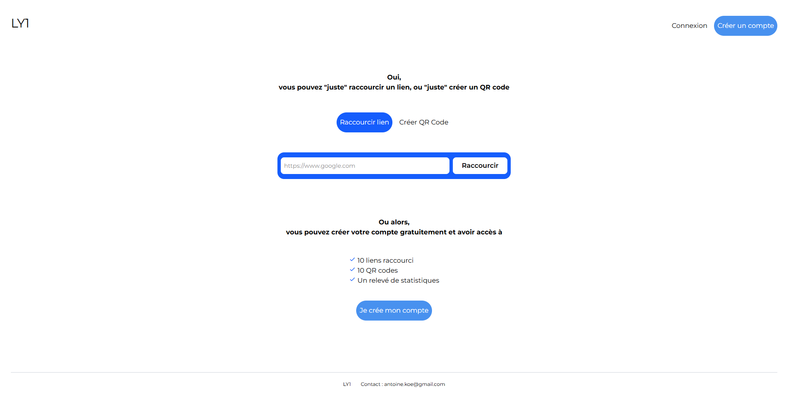

# LY1 - URL Shortener & QR Code Generator

[]()

A modern French URL shortener and QR code generator that simplifies sharing and accessing links efficiently. Built with Node.js, Express, EJS and PostgreSQL, featuring user authentication, temporary links for anonymous users, and a beautiful responsive interface.

## ✨ Features

- **URL Shortening:** Create short, memorable links from long URLs
- **QR Code Generation:** Generate QR codes for any URL with one click
- **User Authentication:** Secure login and registration with local and Google OAuth
- **Temporary Links:** Anonymous users can create temporary links
- **User Dashboard:** Manage your links and QR codes with statistics
- **Click Tracking:** Monitor how many times your links are clicked
- **Modern UI/UX:** Beautiful, responsive design built with Tailwind CSS
- **Rate Limiting:** Protection against abuse with intelligent rate limiting
- **Security Features:** HTTPS support, secure sessions, and input validation
- **Custom Domain Support:** Works with custom domain : ly1.fr

## 🛠️ Technologies Used

- **Backend:**

  - Node.js
  - Express.js
  - PostgreSQL
  - Passport.js
  - Express Session
  - bcrypt
  - nanoid
  - qrcode

- **Frontend:**

  - EJS (templating engine)
  - Tailwind CSS
  - Vanilla JavaScript
  - Boxicons

- **Authentication:**

  - Passport Local Strategy
  - Passport Google OAuth2
  - Express Session

- **Security:**

  - Helmet.js
  - Express Rate Limit
  - Input validation and sanitization
  - CORS protection

- **Deployment:**
  - Railway
  - Cloudflare

## 🚀 Installation

1. **Clone the repository:**

   ```bash
   git clone https://github.com/Antoinekoe/ly1.git
   cd ly1
   ```

2. **Install dependencies:**

   ```bash
   npm install
   ```

3. **Set up environment variables:**

   Create a `.env` file in the root directory:

   ```env
   NODE_ENV=development
   PORT=3000
   SESSION_SECRET=your-super-secret-session-key

   # Database Configuration
   DATABASE_URL=your_postgresql_connection_string
   # OR individual database variables:
   USER=your_db_user
   HOST=localhost
   DATABASE=ly1_db
   PASSWORD=your_db_password
   DATABASE_PORT=5432

   # Google OAuth (optional)
   GOOGLE_CLIENT_ID=your_google_client_id
   GOOGLE_CLIENT_SECRET=your_google_client_secret
   GOOGLE_CALLBACK_URL=your_google_callback_url
   ```

4. **Set up the database:**

   ```bash
   # Create the database tables
   psql -d your_database_name -f db.sql
   ```

5. **Build CSS (optional for development):**

   ```bash
   npm run build:css
   ```

6. **Start the development server:**

   ```bash
   npm run dev
   ```

   The application will be available at `http://localhost:3000`.

## 📁 Project Structure

```
ly1/
├── src/                      # Source code
│   ├── config/              # Configuration files
│   │   ├── database.js      # Database connection
│   │   └── passport.js      # Passport authentication setup
│   ├── controllers/         # Route controllers
│   │   ├── adminController.js # Admin dashboard operations
│   │   ├── authController.js  # Authentication operations
│   │   ├── qrController.js    # QR code operations
│   │   └── urlController.js   # URL shortening operations
│   ├── middleware/          # Express middlewares
│   │   ├── auth.js          # Authentication middleware
│   │   ├── errorHandler.js  # Error handling middleware
│   │   ├── rateLimiting.js  # Rate limiting middleware
│   │   ├── security.js      # Security headers middleware
│   │   └── validation.js    # Input validation middleware
│   ├── models/              # Database models
│   │   ├── link.js          # Link model
│   │   ├── QRcode.js        # QR code model
│   │   └── user.js          # User model
│   ├── routes/              # API routes
│   │   ├── admin.js         # Admin dashboard routes
│   │   ├── api.js           # API endpoints
│   │   ├── auth.js          # Authentication routes
│   │   ├── index.js         # Main route index
│   │   ├── shortUrlRoute.js # Short URL redirection
│   │   └── urls.js          # URL creation routes
│   ├── utils/               # Utility functions
│   │   ├── helper.js        # Helper functions
│   │   └── validation.js    # Validation utilities
│   └── app.js               # Main application file
├── views/                   # EJS templates
│   ├── partials/            # Reusable template parts
│   │   └── footer.ejs       # Footer component
│   ├── admin.ejs            # Admin dashboard page
│   ├── error.ejs            # Error page
│   ├── index.ejs            # Home page
│   ├── login.ejs            # Login page
│   └── signup.ejs           # Registration page
├── public/                  # Static files
│   ├── css/                 # Stylesheets
│   │   ├── input.css        # Tailwind input
│   │   └── output.css       # Compiled CSS
│   └── js/                  # Client-side JavaScript
│       └── script.js        # Main script file
├── db.sql                   # Database schema
├── index.js                 # Application entry point
├── package.json             # Dependencies and scripts
├── tailwind.config.js       # Tailwind CSS configuration
└── README.md                # This file
```

## 🔐 How to Use

1. **Home Page:** Visit the landing page to shorten URLs or create QR codes
2. **Anonymous Usage:** Create temporary links and QR codes without registration
3. **User Registration:** Sign up for a free account to access advanced features
4. **Authentication:** Log in with email/password or Google OAuth
5. **Dashboard:** Access your personal dashboard to manage links and QR codes
6. **URL Management:**
   - Create up to 10 short URLs per account
   - Track click statistics
   - Delete unwanted links
   - Copy links to clipboard
7. **QR Code Management:**
   - Generate QR codes for any URL
   - Download QR codes as PNG images
   - Track scan statistics
   - Manage up to 10 QR codes per account

## 🔒 Security Features

- **Secure Authentication:** bcrypt password hashing and session management
- **Rate Limiting:** Protection against abuse with configurable limits
- **Input Validation:** Server-side validation for all user inputs
- **XSS Protection:** Input sanitization and secure headers
- **CSRF Protection:** Session-based CSRF protection
- **SQL Injection Prevention:** Parameterized queries
- **Secure Headers:** Helmet.js for security headers
- **HTTPS Support:** Full HTTPS support with secure cookies

## 🚀 Deployment

### Railway Deployment

1. **Connect to Railway:**

   - Connect your GitHub repository to Railway
   - Railway will automatically detect the Node.js application

2. **Configure Environment Variables:**

   ```env
   NODE_ENV=production
   DATABASE_URL=your_railway_postgresql_url
   SESSION_SECRET=your-production-session-secret
   GOOGLE_CLIENT_ID=your_google_client_id
   GOOGLE_CLIENT_SECRET=your_google_client_secret
   GOOGLE_CALLBACK_URL=https://ly1.fr/auth/google/callback
   ```

3. **Add PostgreSQL Database:**

   - Add a PostgreSQL database in Railway
   - Railway will automatically set the `DATABASE_URL`

4. **Configure Custom Domain:**
   - Add your custom domain (e.g., ly1.fr)
   - Configure DNS settings

### Cloudflare Configuration

1. **Add Domain to Cloudflare:**

   - Add your domain to Cloudflare
   - Update nameservers

2. **SSL/TLS Settings:**

   - Set SSL/TLS mode to "Full" or "Full (strict)"
   - Enable "Always Use HTTPS"

3. **DNS Configuration:**
   - Add CNAME record pointing to your Railway app

## 🤝 How to Contribute

Contributions are welcome!

1. **Fork the repository.**
2. **Create a branch for your feature or fix:**
   ```bash
   git checkout -b feature/my-new-feature
   # or
   git checkout -b bugfix/bug-fix
   ```
3. **Make your changes and commit with a clear message.**
4. **Push your branch to your fork:**
   ```bash
   git push origin feature/my-new-feature
   ```
5. **Create a pull request to the `main` branch of the original repository.**

## 🔧 Potential Improvements (TODO)

- Add link analytics and detailed statistics
- Implement link expiration dates for registered users
- Add bulk URL shortening functionality
- Create API endpoints for third-party integrations
- Add link password protection
- Implement link preview functionality
- Add social media sharing buttons
- Create mobile app version
- Add link categories and tags
- Implement link scheduling
- Add custom QR code styling options
- Create link health monitoring
- Add link backup and restore functionality
- Implement team collaboration features
- Add link performance insights
- Create link templates and presets
- Add multi-language support
- Implement advanced QR code features (logos, colors)
- Add link redirect tracking
- Create link performance dashboard

## 🔑 License

This project is licensed under the MIT License - see the [LICENSE](LICENSE) file for details.
